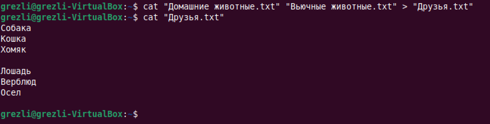

# ControlWork

### Итоговая контрольная работа

## Информация о проекте

Необходимо организовать систему учета для питомника в котором живут
домашние и вьючные животные.
Как сдавать проект
Для сдачи проекта необходимо создать отдельный общедоступный
репозиторий(Github, gitlub, или Bitbucket). Разработку вести в этом
репозитории, использовать пул реквесты на изменения. Программа должна
запускаться и работать, ошибок при выполнении программы быть не должно.
Программа, может использоваться в различных системах, поэтому необходимо
разработать класс в виде конструктора
## Задание

1. Используя команду cat в терминале операционной системы Linux, создать
два файла Домашние животные (заполнив файл собаками, кошками,
хомяками) и Вьючные животными заполнив файл Лошадьми, верблюдами и
ослы), 

а затем объединить их. Просмотреть содержимое созданного файла.

Переименовать файл, дав ему новое имя (Друзья человека).

2. Создать директорию, переместить файл туда.

3. Подключить дополнительный репозиторий MySQL. Установить любой пакет
из этого репозитория.

4. Установить и удалить deb-пакет с помощью dpkg.

5. Выложить историю команд в терминале ubuntu

6. Нарисовать диаграмму, в которой есть класс родительский класс, домашние
животные и вьючные животные, в составы которых в случае домашних
животных войдут классы: собаки, кошки, хомяки, а в класс вьючные животные
войдут: Лошади, верблюды и ослы).

7. В подключенном MySQL репозитории создать базу данных “Друзья
человека”

CREATE DATABASE Друзья_человека;
USE `Друзья_человека`;

8. Создать таблицы с иерархией из диаграммы в БД

CREATE TABLE cat (
	id INT NOT NULL AUTO_INCREMENT PRIMARY KEY,
    Name VARCHAR(45),
    Command VARCHAR(45),
    Birthday DATE
);

CREATE TABLE dog (
	id INT NOT NULL AUTO_INCREMENT PRIMARY KEY,
    Name VARCHAR(45),
    Command VARCHAR(45),
    Birthday DATE
);

CREATE TABLE hamster (
	id INT NOT NULL AUTO_INCREMENT PRIMARY KEY,
    Name VARCHAR(45),
    Command VARCHAR(45),
    Birthday DATE
);

CREATE TABLE horse (
	id INT NOT NULL AUTO_INCREMENT PRIMARY KEY,
    Name VARCHAR(45),
    Command VARCHAR(45),
	Birthday DATE
);

CREATE TABLE camel (
	id INT NOT NULL AUTO_INCREMENT PRIMARY KEY,
    Name VARCHAR(45),
    Command VARCHAR(45),
	Birthday DATE
);

CREATE TABLE donkey (
	id INT NOT NULL AUTO_INCREMENT PRIMARY KEY,
    Name VARCHAR(45),
    Command VARCHAR(45),
	Birthday DATE
);

9.  Заполнить низкоуровневые таблицы именами(животных), командами
которые они выполняют и датами рождения

INSERT INTO cat (Name, Command, Birthday) VALUES
('Барсик', 'Спать', '2012-10-01'),
('Брошка', 'Спать', '2016-06-06'),
('Графиня', 'Спать', '1812-01-06'),
('Мурик', 'Спать', '1990-09-09');
    
SELECT * FROM cat;

INSERT INTO dog (Name, Command, Birthday) VALUES
('Арчи', 'Лежать', '2022-01-01'),
('Жорик', 'Лежать', '2017-06-06'),
('Ричард', 'Лежать', '1812-01-05'),
('Ювентус', 'Лежать', '2010-03-17');
	
SELECT * FROM dog;
 
INSERT INTO hamster (Name, Command, Birthday) VALUES
('Крош', 'Бежать', '2012-01-01'),
('Морсик', 'Бежать', '2017-06-06'),
('Биби', 'Бежать', '2023-01-06'),
('Генерал', 'Бежать', '1912-03-17');
	
SELECT * FROM hamster;
     
INSERT INTO camel (Name, Command, Birthday) VALUES
('Мумрик', 'Поднять', '2022-01-01'),
('Вася', 'Поднять', '1945-07-16'),
('Шрам', 'Поднять', '2000-01-06'),
('Альбертина', 'Поднять', '1985-03-17');
	
SELECT * FROM camel;
     
INSERT INTO horse (Name, Command, Birthday) VALUES
('Рысак', 'Галоп', '2022-01-01'),
('Чемпион', 'Галоп', '2017-06-06'),
('Победа', 'Галоп', '1945-05-09'),
('Непобедимый', 'Галоп', '2021-03-17');
	
SELECT * FROM horse;    
     
INSERT INTO donkey (Name, Command, Birthday) VALUES
('Тайсон', 'Жевать', '2022-01-01'),
('Селия', 'Жевать', '2017-06-06'),
('Пуфик', 'Жевать', '2023-01-06'),
('Еврик', 'Жевать', '2021-03-17');

SELECT * FROM donkey;

10.  Удалив из таблицы верблюдов, т.к. верблюдов решили перевезти в другой
питомник на зимовку. Объединить таблицы лошади, и ослы в одну таблицу.

DELETE FROM  camel WHERE id > 0;
SELECT * FROM camel;  

## Объединение таблицы лошадей и ослов в одну таблицу.

CREATE TABLE unificationAnimalNew (id INT NOT NULL AUTO_INCREMENT PRIMARY KEY)
SELECT  Name, Command, Birthday
FROM horse UNION 
SELECT  Name, Command, Birthday
FROM donkey;

SELECT * FROM unificationAnimalNew; 

11.  Создать новую таблицу “молодые животные” в которую попадут все
животные старше 1 года, но младше 3 лет и в отдельном столбце с точностью
до месяца подсчитать возраст животных в новой таблице

## Создание таблицы, в которой все животные в возрасте от 1 до 3 лет.

CREATE TABLE pets (
	id INT NOT NULL AUTO_INCREMENT PRIMARY KEY,
    Name VARCHAR(45),
    Command VARCHAR(45),
    Birthday DATE
);

CREATE TABLE friendHuman(
	id INT NOT NULL AUTO_INCREMENT PRIMARY KEY,
    Name VARCHAR(45),
    Command VARCHAR(45),
    Birthday Date
    );

INSERT INTO pets (Name, Command, Birthday)
SELECT  Name, Command, Birthday
FROM cat UNION 
SELECT  Name, Command, Birthday
FROM dog UNION
SELECT  Name, Command, Birthday
FROM hamster;

SELECT * FROM pets;

INSERT INTO friendHuman (Name, Command, Birthday)
SELECT  Name, Command, Birthday
FROM pets UNION 
SELECT  Name, Command, Birthday
FROM unificationAnimalNew;

SELECT * FROM friendHuman;

CREATE TABLE youngAnimals (id INT NOT NULL AUTO_INCREMENT PRIMARY KEY)
SELECT Name, 
        Command, 
        Birthday,
        Round((year(current_date()) - year(Birthday)) + (month(current_date() - month(Birthday)))/10, 2) AS age
FROM friendHuman
WHERE  Round((year(current_date()) - year(Birthday)) + (month(current_date() - month(Birthday)))/10, 2) > 1 
AND Round((year(current_date()) - year(Birthday)) + (month(current_date() - month(Birthday)))/10, 2) < 3;
SELECT * FROM youngAnimals;

12.  Объединить все таблицы в одну, при этом сохраняя поля, указывающие на
прошлую принадлежность к старым таблицам.

CREATE TABLE newfriendHuman (id INT NOT NULL AUTO_INCREMENT PRIMARY KEY)
SELECT  Name, Command, Birthday, 'cat' AS oldTable
FROM cat UNION 
SELECT  Name, Command, Birthday, 'dog' AS oldTable
FROM dog UNION
SELECT  Name, Command, Birthday, 'hamster' AS oldTable
FROM hamster UNION 
SELECT  Name, Command, Birthday, 'horse' AS oldTable
FROM horse UNION 
SELECT  Name, Command, Birthday, 'donkey' AS oldTable
FROM donkey;

SELECT * FROM newfriendHuman;

13. Создать класс с Инкапсуляцией методов и наследованием по диаграмме.
14.  Написать программу, имитирующую работу реестра домашних животных.
В программе должен быть реализован следующий функционал:
14.1 Завести новое животное
14.2 определять животное в правильный класс
14.3 увидеть список команд, которое выполняет животное
14.4 обучить животное новым командам
14.5 Реализовать навигацию по меню
15.  Создайте класс Счетчик, у которого есть метод add(), увеличивающий̆
значение внутренней̆int переменной̆на 1 при нажатие “Завести новое
животное” Сделайте так, чтобы с объектом такого типа можно было работать в
блоке try-with-resources. Нужно бросить исключение, если работа с объектом
типа счетчик была не в ресурсном try и/или ресурс остался открыт. Значение
считать в ресурсе try, если при заведения животного заполнены все поля.